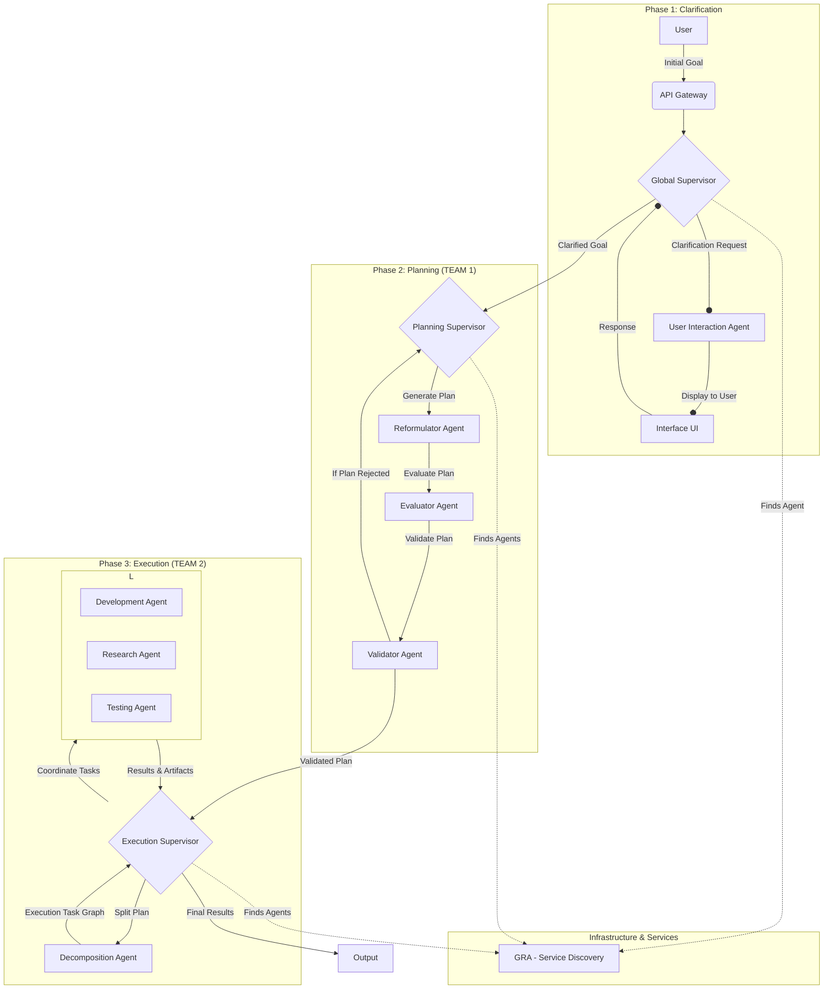
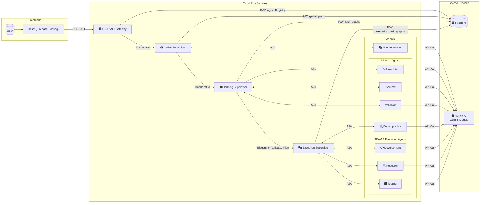

# OrchestrAI Multi-Agent Planner
*A strategic orchestration engine for multi-agent systems.*

---

[](https://cloud.google.com/run) [](https://python.org/) [](https://developers.google.com/agent-framework) [](https://cloud.google.com/) [](https://react.dev/) [](https://kubernetes.io/) [](https://firebase.google.com/docs/firestore) [](https://cloud.google.com/vertex-ai)

---

## ✨ Pitch

A strategic orchestration engine for multi-agent systems. OrchestrAI turns vague user requests into robust, adaptive, and validated action plans.

---

## 🚀 Why OrchestrAI Stands Out

- **Human-in-the-loop automation**: The user remains involved at every key step.
- **Dynamic agent discovery**: Agents are registered and assigned in real time via the GRA registry.
- **Error resilience & incremental execution**: Plans and tasks can be retried, extended or patched without losing previous progress.
- **Composable & extensible**: Add new agents or skills anytime—just register with the GRA and they are orchestrated automatically.
- **A2A protocol & Google ADK compliant**: Ensures interoperability and future-proofing.
- **Full audit trail**: Every decision, correction and outcome is persisted in Firestore for transparency.
- **Isolated dev environments**: Generated code runs in Kubernetes pods managed by the `EnvironmentManager` for safety (see `docs/environment_manager.md`). Environment metadata lives in Firestore and, when no dedicated pod can be created, the manager reuses a shared `exec_default` environment (see `scripts/create_fallback_environment.py`).
- **Real-time agent status**: The GRA exposes `/gra_status` and `/ws/status` endpoints so the dashboard can display each agent's operational state (Idle, Busy, Working, etc.).
- **Agent logs (syslog)**: Each agent exposes a `/logs` route and the GRA proxies it via `/v1/agents/<name>/logs` so the dashboard can fetch runtime logs securely. The GRA server itself exposes `/v1/gra/logs`.
- **Agent restart**: The dashboard provides a restart button calling `/v1/agents/<name>/restart` which relays to each agent's own `/restart` endpoint.
- **Pod file browser**: Files generated inside an isolated environment can be listed, downloaded and uploaded via `/api/environments/<id>/files` and related routes.

---

## 🏗️ Table of Contents

1. [Functional Architecture](#functional-architecture)
2. [Technical Architecture](#technical-architecture)
3. [Key Concepts](#key-concepts)
4. [Installation & Prerequisites](#installation--prerequisites)
5. [Usage](#usage)
6. [Project Structure](#project-structure)
7. [Utility Scripts](#utility-scripts)
8. [Cloud / Firebase Deployment](#cloud--firebase-deployment)
9. [How to Add Your Agent](#how-to-add-your-agent)
10. [Roadmap & Perspectives](#roadmap--perspectives)

---

## 🧭 Functional Architecture

The functional architecture describes the flow from the user's idea all the way to execution by the agent teams.

**View the diagram on [mermaidchart.com](https://www.mermaidchart.com/app/projects/f16a002d-be5d-43d1-bdfb-c095ee3316f6/diagrams/b4c8f941-5b8a-469c-a670-a87c37b12923/version/v0.1/edit)**


## Technical Architecture

The technical architecture reflects the use of **Vertex AI** as the central platform for the Gemini models.



* **Backend Language & Frameworks**:
    * Python 3.11
    * Agents and the GRA run as ASGI servers (Uvicorn) using the A2A SDK (`A2AStarletteApplication`) and FastAPI for the GRA.
* **Agent Business Logic**: Gemini language models via **Google Cloud Vertex AI** (handled in `src/shared/llm_client.py`).
* **Database (Google Cloud Firestore)**:
    * `global_plans`, `task_graphs`, `execution_task_graphs`, `agents` (registry).
* **Inter-Service Communication**: A2A protocol (via `src/clients/a2a_api_client.py`).
* **Front End**: React served from Firebase Hosting.
* **Asynchronous Task Handling**: Extensive use of `asyncio`.
* **Environment Manager**: Creates and manages isolated Kubernetes pods to run the generated code. A dedicated API allows deleting a pod via `DELETE /api/environments/{env_id}`.

## Key Concepts

The project implements a multi-level orchestration pattern with persistent state and dynamic agent discovery.

* **Microservice Architecture** with one directory per agent under `src/agents/`.
* **Global, Planning and Execution supervisors** coordinate the clarification, planning and execution phases.
* **UserInteractionAgent** keeps a human in the loop during goal clarification.
* **TaskGraph** and **ExecutionTaskGraph** manage dependencies for TEAM&nbsp;1 and TEAM&nbsp;2.
* **DecompositionAgent** converts the textual plan into executable tasks.
* **Specialized execution agents** (Development, Research, Testing) handle concrete actions.
* **Service discovery via the GRA** stores agent metadata in Firestore.
* **Iterative planning** allows plan revisions until validation.
* **LLM-powered logic** relies on Gemini models through `llm_client.py`.

## ⚙️ Installation & Prerequisites

This guide covers everything you need to set up the environment and deploy OrchestrAI, both locally and on Google Cloud.

### Step 1: Local Environment Setup

1. **Clone the repository:**
```bash
git clone [URL_de_votre_dépôt]
cd orchestrai-hackathon-ADK
```

2. **Install Core Tools:** Make sure you have the following CLI tools installed on your machine:
* Python 3.11
* Google Cloud SDK (`gcloud`)
* Firebase CLI (`firebase`)
* Docker

3. **Create a Virtual Environment:**
```bash
python3 -m venv venv
source venv/bin/activate
```

4. **Install Python Dependencies:**
```bash
pip install -r requirements_py311.txt
```

### Step 2: Initial Google Cloud Project Setup

1. **Create or select a GCP Project:** Ensure the project is linked to a valid billing account.

2. **Set your Project with gcloud:**
```bash
gcloud config set project YOUR_PROJECT_ID
```

3. **Enable Required APIs:**
```bash
gcloud services enable \
    iam.googleapis.com \
    cloudrun.googleapis.com \
    artifactregistry.googleapis.com \
    cloudbuild.googleapis.com \
    aiplatform.googleapis.com \
    firestore.googleapis.com \
    firebase.googleapis.com \
    container.googleapis.com \
    vpcaccess.googleapis.com
```

### Step 3: Provisioning Core Infrastructure & Permissions

1. **Create VPC Connector & GKE Cluster:**
```bash
./create_vpc_connector.sh
./create_gke_cluster.sh
```

2. **Set Up IAM Permissions:**
```bash
./scripts/grant_agent_permissions.sh
./scripts/grant_gke_permissions_to_cloudrun_sa.sh
./scripts/grant_gclou_kubernet.sh
```

### Step 4: Authentication

1. **For Cloud Deployment (Recommended):**
```bash
gcloud auth login
gcloud auth configure-docker europe-west1-docker.pkg.dev
```

2. **For Local Development & Testing:**
* Create a Service Account in the GCP Console with appropriate roles (e.g., Editor).
* Generate and download a JSON key for this service account.
* Set the following environment variable in your shell:
```bash
export GOOGLE_APPLICATION_CREDENTIALS="/path/to/your/service-account-key.json"
```

You are now fully set up to use the deployment scripts described in the **Usage** and **Cloud Deployment** sections.

## Usage (Local Development)

The `deployment.sh` script can generate a `docker-compose.yml` file to launch all services locally.

1. **Generate the local configuration:**
    ```bash
    ./deployment.sh configure
    ```
2. **Start all services with Docker Compose:**
    ```bash
    cd docker_build
    docker-compose up --build
    ```
    This builds the images and starts the nine containers.

3. **Access the Front End:** the React front end is served by the `user_interaction_agent` service and is available on the port defined in `docker-compose.yml`.

## Cloud / Firebase Deployment

The `deployment.sh` script automates the entire deployment process.

**Deployment prerequisites:**
1. Install and configure the `gcloud` SDK.
2. Authenticate:
    ```bash
    gcloud auth login
    gcloud config set project YOUR_PROJECT_ID
    gcloud auth configure-docker europe-west1-docker.pkg.dev
    ```
3. Enable all required APIs on the project (see Prerequisites section).

**Deployment commands:**
```bash
# Configure, build, push and deploy everything in one go:
./deployment.sh all

# Deploy only the front end after a change:
./deployment.sh deploy_frontend

# Quickly deploy a single agent after modifying its code
# (make sure the agent image has been built and pushed first)
./deployment.sh deploy-one user_interaction_agent

# Rebuild, push and deploy just one agent in a single command
./deployment.sh all_single_agent user_interaction_agent
```
The script automatically injects the correct environment variables (`GCP_PROJECT_ID`, `GCP_REGION`, service URLs) into the deployed containers. API key authentication is no longer required.

## How to Add Your Agent

1. **Create a folder** under `src/agents/<your_agent>`.
2. Add `logic.py`, `executor.py` and `server.py` implementing the agent logic.
3. Make the server register itself to the GRA using the `/v1/agents/register` endpoint.
4. Add a Dockerfile and update `deployment.sh` to build and deploy your new image.
5. Deploy with `./deployment.sh deploy-one <your_agent>` once the image is built.

## Project Structure
```text
orchestrai-hackathon-ADK/
├── src/
│   ├── agents/
│   │   ├── user_interaction_agent/
│   │   ├── decomposition_agent/
│   │   ├── reformulator/
│   │   ├── evaluator/
│   │   ├── validator/
│   │   ├── development_agent/
│   │   ├── research_agent/
│   │   └── testing_agent/
│   ├── orchestrators/
│   │   ├── global_supervisor_logic.py
│   │   ├── planning_supervisor_logic.py
│   │   └── execution_supervisor_logic.py
│   ├── services/
│   │   ├── gra/server.py
│   │   └── environment_manager/environment_manager.py
│   ├── shared/
│   │   ├── task_graph_management.py
│   │   ├── execution_task_graph_management.py
│   │   └── llm_client.py
│   ├── clients/a2a_api_client.py
│   ├── app_frontend.py
│   └── run_orchestrator.py
├── docs/                  # Documentation and diagrams
├── react_frontend/        # React dashboard
├── scripts/               # Helper and deployment scripts
├── tests/                 # Unit and integration tests
├── deployment.sh          # Cloud Run deployment
├── build_and_deploy.sh    # Docker build helper
└── requirements_py311.txt
```

## Utility Scripts

Several helper scripts are provided for deployment and maintenance tasks.

### Shell Scripts

- `build_and_deploy.sh` – generate `requirements.txt`, build the Docker images and push them.
- `create_gke_cluster.sh` – create a GKE cluster and configure `kubectl`.
- `create_vpc_connector.sh` – create a VPC connector for Cloud Run.
- `deployment.sh` – build and deploy all agents and the GRA registry.
- `run_gra_docker.sh` – start the GRA container locally with credentials.
- `setup_ssh_key_github.sh` – configure an SSH key for GitHub and update the remote.
- `test_droit.sh` – grant persistent volume claim permissions on Kubernetes.
- `create_PODimage_and_deploy.sh` – build a `python-devtools` image for isolated environments and push it to GCR.
- `scripts/create_fallback_environment.py` – create the shared fallback pod used when environment creation fails.
- `scripts/deploy_test.sh` – deploy agents using an existing GKE cluster and connector.
- `scripts/grant_agent_permissions.sh` – allow inter-service Cloud Run invocations.
- `scripts/grant_gke_permissions_to_cloudrun_sa.sh` – give the Cloud Run service account access to GKE.
- `scripts/grant_gclou_kubernet.sh` – example script to set up GCP and Kubernetes roles.
- `tests/test_development_agent_curl.sh` – send a test request to the development agent.

### Python Scripts

- `scripts/cleanup_firestore_plans.py` – remove unfinished plans from Firestore.
- `src/run_orchestrator.py` – trigger a planning sequence from the command line.
- `src/tests/k8s_iam_test_server.py` – FastAPI server to test GKE IAM authentication.
- `react_frontend/secure_server.py` – run the React front end with HTTPS.
- `init_projet.py.initial` – example project scaffolding utility.

## Future Enhancements

* More advanced re-planning logic in `ExecutionSupervisorLogic`.
* Finer-grained error handling and retry mechanisms.
* API hardening beyond Cloud Run IAM authentication.
* Collect and display performance statistics per agent.
* Create and document specialized tools for agents (e.g., access to specific databases, etc.).

## Bugs & Improvements

* Integrate an external validation loop into **Team 2** so tasks can be realigned when needed.
* Stabilize communication between the agents and the resource manager.
* Add processing status indicators (e.g., *In Progress*, *IDLE*) to the agent monitoring dashboard.
* Stabilize the file manager component.

## Roadmap & Perspectives

* Advanced re-planning logic once execution errors are detected.
* Harden API security and permission management.
* Provide metrics per agent and better monitoring dashboards.
* Offer additional tools and integrations for specialized tasks.

---

# OrchestrAI Hackathon Project

© 2025 Etienne Revol - Licensed under GPLv3

## About

This software is part of the OrchestrAI Hackathon project. It is distributed under the GNU General Public License v3 (GPLv3).
No part of this software may be reused in proprietary or security-critical systems without the explicit written consent of Etienne Revol.

## License

This project is licensed under the GNU General Public License v3. See the LICENSE file or https://www.gnu.org/licenses/gpl-3.0.html for details.

## Disclaimer

This software is provided "as is", without warranty of any kind. Use at your own risk.
