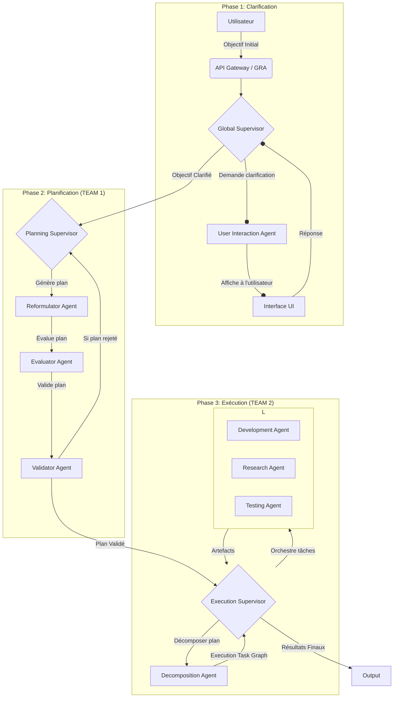
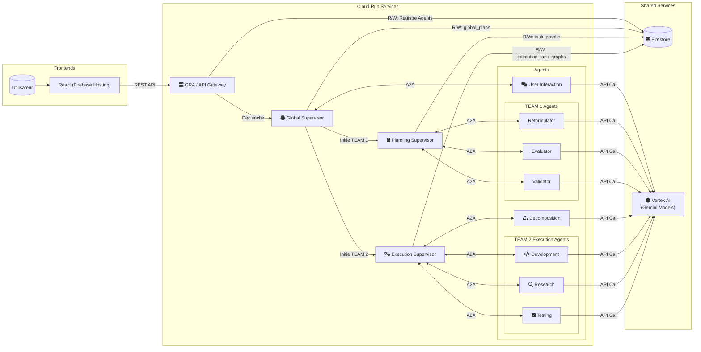

# OrchestrAI – De l’idée à l’action par collaboration d’agents LLM  
*OrchestrAI – From Idea to Action with LLM-Driven Agent Collaboration*

---

[](https://cloud.google.com/run) [](https://python.org/) [](https://developers.google.com/agent-framework) [](https://cloud.google.com/)

---

## ✨ Pitch

> **Français :** > OrchestrAI transforme tout objectif flou en plan d’action détaillé, puis en livrables concrets, grâce à une équipe d’agents IA spécialisés orchestrés dynamiquement. Clarification, planification, exécution : chaque étape est automatisée, supervisée, récupérable, et documentée, tout en intégrant l’utilisateur pour garantir pertinence et qualité.

> **English:** > OrchestrAI turns any vague user goal into a structured plan and concrete deliverables, thanks to a dynamically orchestrated team of specialized AI agents. Clarification, planning, execution: every step is automated, supervised, recoverable, and logged, keeping the user in the loop for quality and relevance.

---

## 🚀 Why OrchestrAI Stands Out

- **Human-in-the-loop automation**: L’utilisateur reste impliqué à chaque étape clé.
- **Dynamic agent discovery**: Agents are registered and assigned in real time via the GRA registry.
- **Error resilience & incremental execution**: Plans and tasks can be retried, extended, or patched without losing previous progress.
- **Composable & extensible**: Add new agents/skills anytime—just register with the GRA and they’re orchestrated automatically.
- **A2A protocol & Google ADK compliant**: Ensures interoperability and future-proofing.
- **Full audit trail**: Every decision, correction, and outcome is persisted in Firestore for transparency.
- **Isolated dev environments**: Generated code runs in Kubernetes pods managed by the `EnvironmentManager` for safety (see `docs/environment_manager.md`).

---

## 🏗️ Table des Matières

1. [Architecture Fonctionnelle](#architecture-fonctionnelle)
2. [Architecture Technique](#architecture-technique)
3. [Principaux Concepts](#principaux-concepts)
4. [Installation et Prérequis](#installation-et-prérequis)
5. [Utilisation](#utilisation)
6. [Structure du Projet](#structure-du-projet)
7. [Déploiement Cloud / Firebase](#déploiement-cloud--firebase)
8. [Comment Ajouter Son Agent](#comment-ajouter-son-agent)
9. [Roadmap & Perspectives](#roadmap--perspectives)

---

## 🧭 Architecture Fonctionnelle

L'architecture fonctionnelle décrit le flux de traitement depuis l'idée de l'utilisateur jusqu'à l'exécution par les équipes d'agents.

**Visualisez ce schéma sur [mermaidchart.com](https://www.mermaidchart.com/app/projects/f16a002d-be5d-43d1-bdfb-c095ee3316f6/diagrams/b4c8f941-5b8a-469c-a670-a87c37b12923/version/v0.1/edit)**



## Architecture Technique

L'architecture technique a été mise à jour pour refléter l'utilisation de **Vertex AI** comme plateforme centrale pour les modèles Gemini.



* **Langage et Frameworks Backend** :
    * Python 3.11
    * Agents et GRA : Serveurs ASGI (Uvicorn), SDK A2A (`A2AStarletteApplication`), FastAPI pour le GRA.
* **Logique Métier des Agents** : Modèles de langage Gemini **via la plateforme Google Cloud Vertex AI** (gérée par `src/shared/llm_client.py`).
* **Base de Données (Google Cloud Firestore)** :
    * `global_plans`, `task_graphs`, `execution_task_graphs`, `agents` (registre).
* **Communication Inter-Services** : Protocole A2A (via `src/clients/a2a_api_client.py`).
* **Front-End** : React, déployé sur Firebase Hosting.
* **Gestion des Tâches Asynchrones** : `asyncio` utilisé extensivement.
* **Environment Manager** : création et gestion de pods Kubernetes isolés pour l'exécution du code produit.

## Prérequis

* **Python 3.11**.
* **Compte Google Cloud** avec un projet créé.
* **API Activées** : Sur votre projet GCP, assurez-vous que les API suivantes sont activées : **Cloud Run, Artifact Registry, Vertex AI, Cloud Firestore, Firebase, Cloud Build, IAM**.
* **Authentification :**
    * **Pour le développement local :** Avoir un fichier de clé de compte de service JSON et définir la variable d'environnement `GOOGLE_APPLICATION_CREDENTIALS` pour pointer vers ce fichier.
    * **Pour le déploiement sur Cloud Run :** Aucune clé n'est nécessaire. L'authentification se fait automatiquement via l'identité du compte de service attaché aux services Cloud Run.
* Bibliothèques Python listées dans `requirements_py311.txt`.

## Installation

1.  Clonez le dépôt.
2.  Créez un environnement virtuel (avec Conda ou venv) en **Python 3.11**.
3.  Installez les dépendances :
    ```bash
    pip install -r requirements_py311.txt
    ```
    Le fichier contient notamment les paquets suivants :
    ```plaintext
    firebase-admin
    google-cloud-aiplatform  # Paquet pour Vertex AI
    httpx
    uvicorn[standard]
    fastapi
    a2a-sdk
    streamlit
    ...
    ```
4.  Configurez votre fichier de credentials pour le développement local.

## Utilisation (Développement Local)

Le script `deployment.sh` peut générer un fichier `docker-compose.yml` pour lancer tous les services localement.

1.  **Générez la configuration locale :**
    ```bash
    ./deployment.sh configure
    ```
2.  **Lancez tous les services avec Docker Compose :**
    ```bash
    cd docker_build
    docker-compose up --build
    ```
    Cela construira les images et démarrera les 9 conteneurs.

3.  **Accédez au Front-End :** Le front-end React est servi par le service `user_interaction_agent` et est accessible sur le port défini dans le `docker-compose.yml`.

## Déploiement sur Google Cloud Run et Firebase

Le script `deployment.sh` automatise entièrement le déploiement.

**Prérequis pour le déploiement :**
1.  Avoir installé et configuré le SDK `gcloud`.
2.  Être authentifié :
    ```bash
    gcloud auth login
    gcloud config set project VOTRE_PROJECT_ID
    gcloud auth configure-docker europe-west1-docker.pkg.dev
    ```
3.  Avoir activé toutes les API requises sur le projet (voir section Prérequis).

**Commandes de déploiement :**
```bash
# Pour tout configurer, builder, pousser et déployer en une seule fois :
./deployment.sh all

# Pour déployer uniquement le front-end après une modification :
./deployment.sh deploy_frontend

# Pour déployer rapidement un seul agent après une modification de son code :
# (Assurez-vous d'avoir build et push l'image de l'agent au préalable)
./deployment.sh deploy-one user_interaction_agent
```
Le script gère automatiquement l'injection des bonnes variables d'environnement (`GCP_PROJECT_ID`, `GCP_REGION`, URLs des services) dans les conteneurs déployés. L'authentification via clé API n'est plus nécessaire.

## Structure du Projet
```Markdown
orchestrai-hackathon-ADK/
├── src/
│   ├── agents/
│   │   ├── ... (8 agents spécialisés)
│   ├── clients/
│   ├── orchestrators/
│   ├── services/
│   │   ├── gra/
│   │   └── environment_manager/
│   └── shared/
├── react_frontend/                   # Interface React légère
├── deployment.sh                     # Script de déploiement Cloud Run
└── requirements_py311.txt            # Fichier de dépendances pour Python 3.11
```

## Pistes d'Évolution Futures

* Logique de replanification plus sophistiquée dans `ExecutionSupervisorLogic`.
* Gestion plus fine des erreurs et mécanismes de reessai.
* Sécurisation des API au-delà de l'authentification IAM de Cloud Run.
* Collecter et afficher des statistiques de performance par agent.
* Créer et documenter des outils spécialisés pour les agents (ex: accès à des bases de données spécifiques, etc.).
