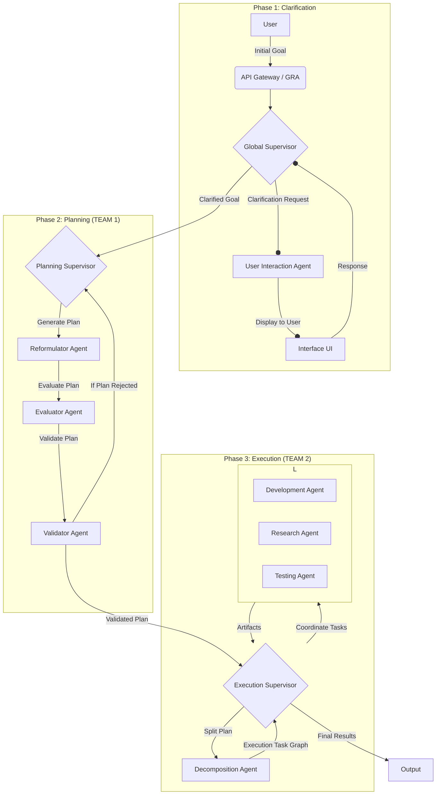
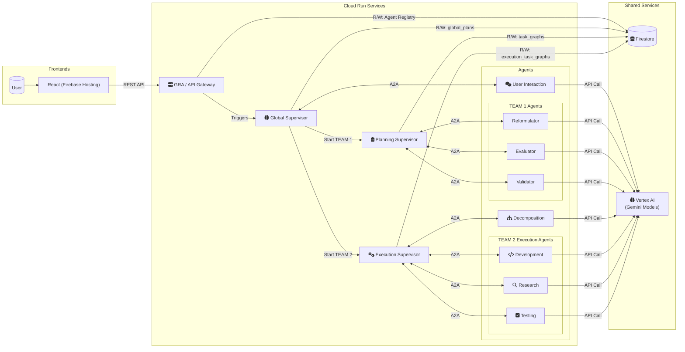

# OrchestrAI – From Idea to Action via LLM Agent Collaboration
*OrchestrAI – From Idea to Action with LLM-Driven Agent Collaboration*

---

[](https://cloud.google.com/run) [](https://python.org/) [](https://developers.google.com/agent-framework) [](https://cloud.google.com/)

---

## ✨ Pitch

OrchestrAI turns any vague user goal into a detailed action plan and concrete deliverables thanks to a dynamically orchestrated team of specialized AI agents. Clarification, planning and execution are fully automated, supervised, recoverable and logged while keeping the user in the loop for relevance and quality.

---

## 🚀 Why OrchestrAI Stands Out

- **Human-in-the-loop automation**: The user remains involved at every key step.
- **Dynamic agent discovery**: Agents are registered and assigned in real time via the GRA registry.
- **Error resilience & incremental execution**: Plans and tasks can be retried, extended or patched without losing previous progress.
- **Composable & extensible**: Add new agents or skills anytime—just register with the GRA and they are orchestrated automatically.
- **A2A protocol & Google ADK compliant**: Ensures interoperability and future-proofing.
- **Full audit trail**: Every decision, correction and outcome is persisted in Firestore for transparency.
- **Isolated dev environments**: Generated code runs in Kubernetes pods managed by the `EnvironmentManager` for safety (see `docs/environment_manager.md`).

---

## 🏗️ Table of Contents

1. [Functional Architecture](#functional-architecture)
2. [Technical Architecture](#technical-architecture)
3. [Key Concepts](#key-concepts)
4. [Installation & Prerequisites](#installation--prerequisites)
5. [Usage](#usage)
6. [Project Structure](#project-structure)
7. [Utility Scripts](#utility-scripts)
8. [Cloud / Firebase Deployment](#cloud--firebase-deployment)
9. [How to Add Your Agent](#how-to-add-your-agent)
10. [Roadmap & Perspectives](#roadmap--perspectives)

---

## 🧭 Functional Architecture

The functional architecture describes the flow from the user's idea all the way to execution by the agent teams.

**View the diagram on [mermaidchart.com](https://www.mermaidchart.com/app/projects/f16a002d-be5d-43d1-bdfb-c095ee3316f6/diagrams/b4c8f941-5b8a-469c-a670-a87c37b12923/version/v0.1/edit)**



## Technical Architecture

The technical architecture reflects the use of **Vertex AI** as the central platform for the Gemini models.



* **Backend Language & Frameworks**:
    * Python 3.11
    * Agents and the GRA run as ASGI servers (Uvicorn) using the A2A SDK (`A2AStarletteApplication`) and FastAPI for the GRA.
* **Agent Business Logic**: Gemini language models via **Google Cloud Vertex AI** (handled in `src/shared/llm_client.py`).
* **Database (Google Cloud Firestore)**:
    * `global_plans`, `task_graphs`, `execution_task_graphs`, `agents` (registry).
* **Inter-Service Communication**: A2A protocol (via `src/clients/a2a_api_client.py`).
* **Front End**: React served from Firebase Hosting.
* **Asynchronous Task Handling**: Extensive use of `asyncio`.
* **Environment Manager**: Creates and manages isolated Kubernetes pods to run the generated code.

## Installation & Prerequisites

* **Python 3.11**
* **Google Cloud account** with a project created
* **Enabled APIs**: ensure **Cloud Run, Artifact Registry, Vertex AI, Cloud Firestore, Firebase, Cloud Build, IAM** are enabled on your project
* **Authentication**
    * **Local development**: have a service account key JSON file and set `GOOGLE_APPLICATION_CREDENTIALS` to its path
    * **Cloud Run deployment**: no key required, authentication happens automatically through the service account attached to the Cloud Run services
* Python libraries listed in `requirements_py311.txt`

### Installation

1. Clone the repository.
2. Create a virtual environment (Conda or venv) with **Python 3.11**.
3. Install dependencies:
    ```bash
    pip install -r requirements_py311.txt
    ```
    This file includes packages such as:
    ```plaintext
    firebase-admin
    google-cloud-aiplatform  # Vertex AI client
    httpx
    uvicorn[standard]
    fastapi
    a2a-sdk
    streamlit
    ...
    ```
4. Configure your credentials file for local development.

## Usage (Local Development)

The `deployment.sh` script can generate a `docker-compose.yml` file to launch all services locally.

1. **Generate the local configuration:**
    ```bash
    ./deployment.sh configure
    ```
2. **Start all services with Docker Compose:**
    ```bash
    cd docker_build
    docker-compose up --build
    ```
    This builds the images and starts the nine containers.

3. **Access the Front End:** the React front end is served by the `user_interaction_agent` service and is available on the port defined in `docker-compose.yml`.

## Cloud / Firebase Deployment

The `deployment.sh` script automates the entire deployment process.

**Deployment prerequisites:**
1. Install and configure the `gcloud` SDK.
2. Authenticate:
    ```bash
    gcloud auth login
    gcloud config set project YOUR_PROJECT_ID
    gcloud auth configure-docker europe-west1-docker.pkg.dev
    ```
3. Enable all required APIs on the project (see Prerequisites section).

**Deployment commands:**
```bash
# Configure, build, push and deploy everything in one go:
./deployment.sh all

# Deploy only the front end after a change:
./deployment.sh deploy_frontend

# Quickly deploy a single agent after modifying its code
# (make sure the agent image has been built and pushed first)
./deployment.sh deploy-one user_interaction_agent
```
The script automatically injects the correct environment variables (`GCP_PROJECT_ID`, `GCP_REGION`, service URLs) into the deployed containers. API key authentication is no longer required.

## Project Structure
```Markdown
orchestrai-hackathon-ADK/
├── src/
│   ├── agents/
│   │   ├── ... (8 specialized agents)
│   ├── clients/
│   ├── orchestrators/
│   ├── services/
│   │   ├── gra/
│   │   └── environment_manager/
│   └── shared/
├── react_frontend/                   # Lightweight React interface
├── deployment.sh                     # Cloud Run deployment script
└── requirements_py311.txt            # Dependency list for Python 3.11
```

## Utility Scripts

Several helper scripts are provided for deployment and maintenance tasks.

### Shell Scripts

- `build_and_deploy.sh` – generate `requirements.txt`, build the Docker images and push them.
- `create_gke_cluster.sh` – create a GKE cluster and configure `kubectl`.
- `create_vpc_connector.sh` – create a VPC connector for Cloud Run.
- `deployment.sh` – build and deploy all agents and the GRA registry.
- `run_gra_docker.sh` – start the GRA container locally with credentials.
- `setup_ssh_key_github.sh` – configure an SSH key for GitHub and update the remote.
- `test_droit.sh` – grant persistent volume claim permissions on Kubernetes.
- `scripts/deploy_test.sh` – deploy agents using an existing GKE cluster and connector.
- `scripts/grant_agent_permissions.sh` – allow inter-service Cloud Run invocations.
- `scripts/grant_gke_permissions_to_cloudrun_sa.sh` – give the Cloud Run service account access to GKE.
- `scripts/grant_gclou_kubernet.sh` – example script to set up GCP and Kubernetes roles.
- `tests/test_development_agent_curl.sh` – send a test request to the development agent.

### Python Scripts

- `scripts/cleanup_firestore_plans.py` – remove unfinished plans from Firestore.
- `src/run_orchestrator.py` – trigger a planning sequence from the command line.
- `src/tests/k8s_iam_test_server.py` – FastAPI server to test GKE IAM authentication.
- `react_frontend/secure_server.py` – run the React front end with HTTPS.
- `init_projet.py.initial` – example project scaffolding utility.

## Step 3.1: Pod Execution Permissions with Workload Identity

OrchestrAI uses **GKE Workload Identity** to securely map Kubernetes service
accounts (KSAs) to Google Cloud service accounts (GSAs). This allows code running
in isolated pods to access Firestore and other Google services while still
enforcing Kubernetes RBAC rules.

### IAM configuration

1. Create the Kubernetes service account:

   ```bash
   kubectl create serviceaccount orchestrai-sa --namespace default
   ```

2. Create the Google service account (if needed):

   ```bash
   gcloud iam service-accounts create orchestrai-gra-firestore \
     --display-name "OrchestrAI GRA Firestore Access"
   ```

3. Allow the KSA to act as the GSA using Workload Identity. First find your
   Workload Identity pool:

   ```bash
   gcloud container clusters describe YOUR_CLUSTER_NAME --zone YOUR_CLUSTER_ZONE \
     --format="value(workloadIdentityConfig.workloadPool)"
   ```

   It should look like `YOUR_PROJECT_ID.svc.id.goog`.

   Then bind the identity:

   ```bash
   gcloud iam service-accounts add-iam-policy-binding \
     orchestrai-gra-firestore@YOUR_PROJECT_ID.iam.gserviceaccount.com \
     --role roles/iam.workloadIdentityUser \
     --member "serviceAccount:YOUR_PROJECT_ID.svc.id.goog[default/orchestrai-sa]"
   ```

4. Annotate the KSA so pods use the GSA:

   ```bash
   kubectl annotate serviceaccount orchestrai-sa \
     iam.gke.io/gcp-service-account=orchestrai-gra-firestore@YOUR_PROJECT_ID.iam.gserviceaccount.com
   ```

### RBAC for pod exec

Create the following role and binding:

```yaml
# orchestrai-pod-exec-role.yaml
apiVersion: rbac.authorization.k8s.io/v1
kind: Role
metadata:
  name: orchestrai-pod-exec-role
  namespace: default
rules:
- apiGroups: [""]
  resources: ["pods"]
  verbs: ["get", "list", "watch"]
- apiGroups: [""]
  resources: ["pods/exec"]
  verbs: ["create", "get"]
---
apiVersion: rbac.authorization.k8s.io/v1
kind: RoleBinding
metadata:
  name: orchestrai-pod-exec-rolebinding
  namespace: default
roleRef:
  apiGroup: rbac.authorization.k8s.io
  kind: Role
  name: orchestrai-pod-exec-role
subjects:
- kind: ServiceAccount
  name: orchestrai-sa
  namespace: default
```

Apply it with:

```bash
kubectl apply -f orchestrai-pod-exec-role.yaml
```

If you require cluster-wide permissions, create a `ClusterRole` and
`ClusterRoleBinding` instead.

### Notes for contributors

Pods launched by the `EnvironmentManager` automatically use `orchestrai-sa`. They
inherit the permissions above, letting generated code interact with Google
services while keeping pod execution secure.

## Future Enhancements

* More advanced re-planning logic in `ExecutionSupervisorLogic`.
* Finer-grained error handling and retry mechanisms.
* API hardening beyond Cloud Run IAM authentication.
* Collect and display performance statistics per agent.
* Create and document specialized tools for agents (e.g., access to specific databases, etc.).
