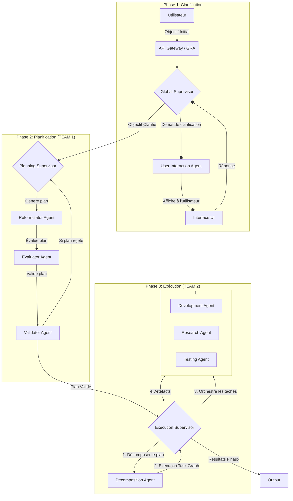

# OrchestrAI Hackathon ADK - Système de Planification et d'Exécution Multi-Agents Interactif

## English Summary
This repository hosts an interactive multi-agent system built for the OrchestrAI hackathon. Users submit an initial objective through the Streamlit dashboard. The system clarifies the goal with the `UserInteractionAgent`, generates and validates a plan with TEAM&nbsp;1 (`Reformulator`, `Evaluator`, `Validator`) and then executes it with TEAM&nbsp;2 (`Decomposition`, `Development`, `Research`, `Testing`). Supervisors orchestrate each phase and all agents register to the Resource and Agent Manager (GRA). Data is stored in Firestore and the interface displays interactive task graphs thanks to *streamlit-agraph*.

Ce projet est une implémentation d'un système multi-agents pour la clarification interactive d'objectifs, suivie par la génération, l'évaluation, la validation, la révision itérative de plans (TEAM 1), et enfin l'exécution décomposée de ces plans (TEAM 2). Il utilise un Agent Development Kit (ADK) basé sur le protocole A2A, avec une persistance des données via Firestore et une découverte de services gérée par un Gestionnaire de Ressources et d'Agents (GRA). Les agents intègrent des modèles de langage (LLM via Gemini) pour leur logique métier.

La principale évolution est l'introduction d'un `GlobalSupervisorLogic` et d'un `UserInteractionAgent` pour affiner l'objectif initial avec l'utilisateur (Phase de Clarification), le passage à une équipe de planification détaillée (TEAM 1 : PLAN GENERATION orchestrée par `PlanningSupervisorLogic`), et enfin, une nouvelle phase d'exécution du plan validé (TEAM 2 : PLAN EXECUTION orchestrée par `ExecutionSupervisorLogic`).

### Principaux modules
- `src/app_frontend.py` : Tableau de bord Streamlit avec graphes interactifs.
- `src/agents/` : Implémentations des agents (clarification, planification, exécution).
- `src/orchestrators/` : Superviseurs orchestrant chaque phase du projet.
- `src/services/` : Services internes dont le Gestionnaire de Ressources et d'Agents (GRA).
- `src/shared/` : Utilitaires communs (gestion des graphes, logique et exécuteurs de base).
The English version of these summaries is provided in each module's `README.md`.

## Table des Matières

1.  [Architecture Fonctionnelle](#architecture-fonctionnelle)
    * [Étape 1 : Clarification de l'Objectif (Orchestrée par GlobalSupervisorLogic)](#étape-1--clarification-de-lobjectif-orchestrée-par-globalsupervisorlogic)
    * [Étape 2 : Génération et Itération de Plan (TEAM 1 : PLAN GENERATION, Orchestrée par PlanningSupervisorLogic)](#étape-2--génération-et-itération-de-plan-team-1--plan-generation-orchestrée-par-planningsupervisorlogic)
    * [Étape 3 : Exécution du Plan (TEAM 2 : PLAN EXECUTION, Orchestrée par ExecutionSupervisorLogic)](#étape-3--exécution-du-plan-team-2--plan-execution-orchestrée-par-executionsupervisorlogic)
2.  [Architecture Technique](#architecture-technique)
3.  [Concepts Clés Mis en Œuvre](#concepts-clés-mis-en-œuvre)
4.  [Architecture Générale Détaillée](#architecture-générale-détaillée)
5.  [Prérequis](#prérequis)
6.  [Installation](#installation)
7.  [Utilisation](#utilisation)
8.  [Structure du Projet](#structure-du-projet)
9.  [Pistes d'Évolution Futures](#pistes-dévolution-futures)

## Architecture Fonctionnelle

Cette section décrit les grandes capacités du système et comment les différents composants interagissent pour atteindre l'objectif global, désormais en trois phases distinctes.

https://www.mermaidchart.com/app/projects/f16a002d-be5d-43d1-bdfb-c095ee3316f6/diagrams/b4c8f941-5b8a-469c-a670-a87c37b12923/version/v0.1/edit
### Étape 1 : Clarification de l'Objectif (Orchestrée par `GlobalSupervisorLogic`)

Cette phase cruciale garantit que l'objectif soumis par l'utilisateur est suffisamment clair et détaillé avant d'engager des ressources dans la planification ou l'exécution.

* **Soumission d'Objectif** : L'utilisateur initie le processus via l'interface Streamlit (`app_frontend.py`), qui communique avec l'API du GRA.
* **Orchestration Globale** : Le `GlobalSupervisorLogic` enregistre l'objectif et gère l'état du dialogue dans la collection `global_plans` de Firestore.
* **Dialogue Interactif via `UserInteractionAgent`** :
    * Le `GlobalSupervisorLogic` invoque le `UserInteractionAgent`.
    * Cet agent utilise un LLM pour analyser l'objectif, estimer son type (ex: "Software Development", "Redaction/Research"), identifier les manques d'informations critiques, proposer des enrichissements, et formuler des questions à l'utilisateur. Il retourne un JSON structuré.
    * L'état du plan global passe à `CLARIFICATION_PENDING_USER_INPUT`.
* **Boucle de Clarification via Streamlit** : L'interface affiche la question, l'objectif enrichi (éditable), et les éléments assumés. L'utilisateur répond ou modifie l'objectif.
* **Acceptation de l'Objectif** : Si l'objectif est jugé satisfaisant, l'utilisateur valide, le `GlobalSupervisorLogic` marque l'objectif comme `OBJECTIVE_CLARIFIED` et initie la phase suivante (TEAM 1).

### Étape 2 : Génération et Itération de Plan (TEAM 1 : PLAN GENERATION, Orchestrée par `PlanningSupervisorLogic`)

Une fois l'objectif clarifié, cette phase crée un plan d'action détaillé.

* **Orchestration Centralisée (TEAM 1)** : Le `PlanningSupervisorLogic` pilote le flux, recevant l'objectif clarifié du `GlobalSupervisorLogic`.
* **Reformulation** : `ReformulatorAgent` génère un plan d'action détaillé via LLM.
* **Évaluation** : `EvaluatorAgent` analyse le plan, identifie forces/faiblesses, et donne un score de faisabilité (via LLM), retournant un JSON.
* **Validation** : `ValidatorAgent` approuve ou rejette le plan avec justification (via LLM).
* **Boucle de Révision** : En cas de rejet, le `PlanningSupervisorLogic` intègre les commentaires et relance une reformulation (jusqu'à `max_revisions`).

### Étape 3 : Exécution du Plan (TEAM 2 : PLAN EXECUTION, Orchestrée par `ExecutionSupervisorLogic`)

Après la validation du plan détaillé par TEAM 1, cette nouvelle phase prend en charge son exécution concrète.

* **Initiation par `GlobalSupervisorLogic`** : Une fois que TEAM 1 a produit un plan validé (`TEAM1_PLANNING_COMPLETED`), le `GlobalSupervisorLogic` initie TEAM 2. Il récupère le plan final de TEAM 1 et le transmet à `ExecutionSupervisorLogic`.
* **Orchestration de l'Exécution (`ExecutionSupervisorLogic`)** :
    * Ce superviseur prend le plan validé de TEAM 1.
    * **Décomposition du Plan d'Exécution** : Il invoque le `DecompositionAgent`. Cet agent prend le plan textuel de TEAM 1 et le décompose en une structure JSON globale de tâches granulaires (un `ExecutionTaskGraph`) adaptées à l'exécution. Cette structure inclut le contexte global, les instructions, et une liste de tâches avec leurs descriptions, types (`executable`, `exploratory`, `container`), dépendances, instructions locales, critères d'acceptation et le type d'agent d'exécution suggéré.
    * **Gestion de l'`ExecutionTaskGraph`** : `ExecutionSupervisorLogic` gère ce graphe de tâches d'exécution, stocké dans Firestore (collection `execution_task_graphs`).
    * **Assignation et Exécution des Tâches** : Pour chaque tâche prête dans l'`ExecutionTaskGraph`:
        * `ExecutionSupervisorLogic` identifie la compétence requise (ex: `coding_python`, `web_research`, `software_testing`).
        * Il découvre un agent approprié via le GRA. Les agents d'exécution disponibles sont :
            * `DevelopmentAgent`: Pour les tâches de génération de code (ex: compétence `coding_python`).
            * `ResearchAgent`: Pour les tâches de recherche, d'analyse ou de synthèse de documents (compétences `general_analysis`, `web_research`, `document_synthesis`).
            * `TestingAgent`: Pour tester les livrables, comme du code, par rapport à des spécifications (compétence `software_testing`).
        * L'agent sélectionné exécute la tâche et produit des artefacts (ex: code source, rapport de recherche, rapport de test).
    * **Gestion des Tâches Exploratoires** : Les tâches de type `exploratory` (souvent gérées par `ResearchAgent`) peuvent retourner des résultats qui incluent la définition de nouvelles sous-tâches, enrichissant dynamiquement l'`ExecutionTaskGraph`.
* **Suivi et Finalisation** : `ExecutionSupervisorLogic` suit l'état de toutes les tâches d'exécution. Une fois toutes les tâches terminées, l'état global du plan d'exécution (`EXECUTION_COMPLETED_SUCCESSFULLY` ou `EXECUTION_COMPLETED_WITH_FAILURES`) est déterminé. Le `GlobalSupervisorLogic` met à jour l'état du `global_plan` en conséquence.
* **Reprise d'un Plan en Cours** : la nouvelle méthode `continue_execution` permet de relancer un plan existant lorsque des tâches demeurent en `pending` ou `ready`. Un bouton "Reprendre l'exécution" est disponible dans l'interface React pour déclencher cette action.

### Capacités Transverses :

* **Découverte de Services** : Les agents s'enregistrent auprès du GRA. Les superviseurs interrogent le GRA pour localiser les agents.
* **Persistance des Données** :
    * `global_plans`: État des plans globaux et dialogue de clarification.
    * `task_graphs`: Plans détaillés de TEAM 1.
    * `execution_task_graphs`: Plans d'exécution décomposés et état des tâches de TEAM 2. (Nouvelle collection)
    * `agents`: Enregistrement des agents par le GRA.
* **Interface Utilisateur et Monitoring (Streamlit)** : Permet la soumission d'objectifs, le dialogue de clarification, le listage des plans globaux, la visualisation des graphes de tâches (TEAM 1 et potentiellement TEAM 2), la consultation des artefacts et le statut des agents.

## Architecture Technique


https://www.mermaidchart.com/app/projects/f16a002d-be5d-43d1-bdfb-c095ee3316f6/diagrams/49311d22-3e45-4a3a-bc95-dc778de81caf/version/v0.1/edit

* **Langage et Frameworks Backend** :
    * Python 3.11+
    * Agents et GRA : Serveurs ASGI (Uvicorn), SDK A2A (`A2AStarletteApplication`), FastAPI pour le GRA.
* **Logique Métier des Agents** : Modèles de langage Gemini (gérée par `src/shared/llm_client.py`), supportant le mode JSON.
* **Base de Données (Google Cloud Firestore)** :
    * `global_plans`
    * `task_graphs` (pour TEAM 1)
    * `execution_task_graphs` (pour TEAM 2)
    * `agents` (registre GRA)
    * Publication URL du GRA (`service_registry/gra_instance_config`)
* **Communication Inter-Services** :
    * Protocole A2A (via `src/clients/a2a_api_client.py`)
    * API REST (HTTP/JSON) pour Streamlit <-> GRA, Agents <-> GRA.
* **Front-End** : Streamlit, Graphviz.
* **Gestion des Tâches Asynchrones** : `asyncio` utilisé extensivement. `GlobalSupervisorLogic` lance les traitements de TEAM 1 et TEAM 2 en tâches de fond.

## Concepts Clés Mis en Œuvre

* **Architecture Microservices/Agents** : Modularité et scalabilité.
* **Orchestration à Plusieurs Niveaux** : `GlobalSupervisorLogic` (clarification, lancement TEAM 1 & 2), `PlanningSupervisorLogic` (TEAM 1), `ExecutionSupervisorLogic` (TEAM 2).
* **Agent Interactif (Human-in-the-Loop)** : `UserInteractionAgent` pour la clarification.
* **Orchestration de Tâches (TEAM 1 & TEAM 2)** : Gestion de graphes de tâches (`TaskGraph` pour TEAM 1, `ExecutionTaskGraph` pour TEAM 2).
* **Décomposition de Plan d'Exécution (TEAM 2)** : Le `DecompositionAgent` structure le plan de TEAM 1 en tâches exécutables/exploratoires pour TEAM 2.
* **Agents d'Exécution Spécialisés (TEAM 2)** : `DevelopmentAgent`, `ResearchAgent`, `TestingAgent` effectuent des tâches concrètes.
* **Exécution de Plan Dynamique (TEAM 2)** : Les tâches exploratoires peuvent générer de nouvelles sous-tâches pendant l'exécution.
* **Service Discovery** : GRA pour la découverte dynamique d'agents.
* **Persistance des Données Structurée** : Collections Firestore distinctes.
* **Traitement Itératif et Réflexif (TEAM 1)** : Boucle de révision.
* **Intelligence Artificielle (LLM)** : Gemini pour la logique des agents.
* **Communication Asynchrone**.

## Architecture Générale Détaillée

Le système est composé des principaux éléments suivants :

* **Agents Spécialisés** :
    * `UserInteractionAgent` : Analyse l'objectif, pose des questions, propose un objectif enrichi (JSON).
    * `ReformulatorAgent` (TEAM 1) : Transforme un objectif en plan détaillé structuré.
    * `EvaluatorAgent` (TEAM 1) : Analyse un plan, identifie forces/faiblesses, score de faisabilité (JSON).
    * `ValidatorAgent` (TEAM 1) : Approuve ou rejette un plan évalué avec justification.
    * `DecompositionAgent` (TEAM 2) : Décompose le plan validé de TEAM 1 en un `ExecutionTaskGraph` (JSON) pour TEAM 2.
    * `DevelopmentAgent` (TEAM 2) : Génère du code source (ex: Python) basé sur des spécifications.
    * `ResearchAgent` (TEAM 2) : Effectue des recherches, analyses, et peut proposer de nouvelles sous-tâches.
    * `TestingAgent` (TEAM 2) : Teste des livrables (ex: code) et génère des rapports de test (JSON).
    * Chaque agent est un serveur A2A autonome.

* **Gestionnaire de Ressources et d'Agents (GRA)** : Service central (FastAPI/Uvicorn) utilisant Firestore.
    * Registre d'Agents, API Gateway pour le Front-End.

* **Superviseurs (Orchestrateurs)** :
    * `GlobalSupervisorLogic` : Orchestre la phase de clarification interactive, gère le `GlobalPlan` sur Firestore, et initie TEAM 1 puis TEAM 2.
    * `PlanningSupervisorLogic` (Orchestrateur de TEAM 1) : Gère le `TaskGraph` (planification détaillée) sur Firestore, orchestre les agents de TEAM 1, implémente la boucle de révision.
    * `ExecutionSupervisorLogic` (Orchestrateur de TEAM 2) : Gère l'`ExecutionTaskGraph` sur Firestore, orchestre les agents de TEAM 2 (Decomposition, Development, Research, Testing) pour exécuter le plan.

* **Client LLM Partagé** (`src/shared/llm_client.py`) : Interagit avec l'API Gemini.
* **Front-End Streamlit** (`src/app_frontend.py`) : Interface utilisateur.

## Prérequis

* Python 3.11+
* Compte Google Cloud avec Firestore activé.
* Fichier de clé de compte de service JSON (`GOOGLE_APPLICATION_CREDENTIALS`).
* Variables d'environnement : `GOOGLE_APPLICATION_CREDENTIALS`, `GEMINI_API_KEY`.
* (Optionnel) `GRA_PUBLIC_URL`, `AGENT_XXX_PUBLIC_URL`.
* Bibliothèques Python listées dans `requirements.txt`.
* Graphviz (installation système).

## Installation

1.  Clonez le dépôt.
2.  Créez un environnement virtuel et activez-le.
3.  Installez les dépendances :
    ```bash
    pip install -r requirements.txt
    ```
    Le fichier `requirements.txt` devrait contenir au minimum (adaptez si besoin) :
    ```plaintext
    firebase-admin
    google-generativeai
    httpx
    uvicorn[standard]
    fastapi
    a2a-sdk
    streamlit
    graphviz
    pydantic
    ```
4.  Configurez les variables d'environnement.
5.  Installez Graphviz sur votre système si ce n'est pas déjà fait.

## Utilisation

Pour lancer le système complet, le GRA et tous les agents doivent être démarrés.

1.  **Démarrez le Gestionnaire de Ressources et d'Agents (GRA)** :
    ```bash
    python -m src.services.gra.server
    ```
    Vérifiez les logs pour la confirmation de la connexion à Firestore et la publication de son URL.

2.  **Démarrez les Agents (chacun dans un nouveau terminal)** :
    * Agent d'Interaction Utilisateur (`UserInteractionAgentServer`):
        ```bash
        python -m src.agents.user_interaction_agent.server
        ```
    * Agent Reformulateur (`ReformulatorAgentServer` - TEAM 1):
        ```bash
        python -m src.agents.reformulator.server
        ```
    * Agent Évaluateur (`EvaluatorAgentServer` - TEAM 1):
        ```bash
        python -m src.agents.evaluator.server
        ```
    * Agent Validateur (`ValidatorAgentServer` - TEAM 1):
        ```bash
        python -m src.agents.validator.server
        ```
    * Agent de Décomposition (`DecompositionAgentServer` - TEAM 2):
        ```bash
        python -m src.agents.decomposition_agent.server
        ```
    * Agent de Développement (`DevelopmentAgentServer` - TEAM 2):
        ```bash
        python -m src.agents.development_agent.server
        ```
    * Agent de Recherche (`ResearchAgentServer` - TEAM 2):
        ```bash
        python -m src.agents.research_agent.server
        ```
    * Agent de Test (`TestingAgentServer` - TEAM 2):
        ```bash
        python -m src.agents.testing_agent.server
        ```
    Vérifiez les logs de chaque agent pour confirmer leur enregistrement auprès du GRA.

3.  **Lancez l'Application Streamlit (Front-End)** :
    ```bash
    streamlit run src/app_frontend.py
    ```
    Ouvrez l'URL fournie par Streamlit (généralement `http://localhost:8501`) dans votre navigateur.

    Vous pouvez également tester une interface React très simple disponible dans le dossier `react_frontend` :
    ```bash
    cd react_frontend && python -m http.server 8080
    ```
    Puis ouvrez [http://localhost:8080/index.html](http://localhost:8080/index.html).
    L'API backend reste disponible sur `http://localhost:8000`. Si besoin, vous pouvez spécifier une autre URL en définissant `BACKEND_API_URL` avant de charger les scripts.

4.  **Utilisez l'Interface** :
    * Soumettez un nouvel objectif.
    * Interagissez avec l'`UserInteractionAgent` pour la clarification.
    * Validez l'objectif pour lancer TEAM 1 (planification).
    * TEAM 1 générera un plan. Si approuvé, TEAM 2 (exécution) sera initiée automatiquement par le `GlobalSupervisorLogic`.
    * Suivez l'évolution des plans globaux et des graphes de tâches.

5.  **Pour lancer un test complet du flux (Clarification -> TEAM 1 -> TEAM 2) via script backend** :
    (Utile pour tester l'ensemble du pipeline sans l'interface Streamlit.)
    Assurez-vous que le GRA et tous les agents (UserInteraction, TEAM 1, TEAM 2) sont en cours d'exécution, puis :
    ```bash
    python -m src.orchestrators.global_supervisor_logic
    ```
    (Note : Ce script exécute la fonction `main_test_global_supervisor` qui simule le flux complet.)

## Structure du Projet (Principaux Dossiers et Fichiers)
```Markdown
orchestrai-hackathon-ADK/
├── src/
│   ├── agents/
│   │   ├── user_interaction_agent/   # Clarification
│   │   ├── reformulator/             # TEAM 1
│   │   ├── evaluator/                # TEAM 1
│   │   ├── validator/                # TEAM 1
│   │   ├── decomposition_agent/      # TEAM 2 (Nouveau)
│   │   ├── development_agent/        # TEAM 2 (Nouveau)
│   │   ├── research_agent/           # TEAM 2 (Nouveau)
│   │   └── testing_agent/            # TEAM 2 (Nouveau)
│   │       └── ... (logic.py, executor.py, server.py pour chaque)
│   ├── clients/
│   │   └── a2a_api_client.py
│   ├── orchestrators/
│   │   ├── global_supervisor_logic.py    # Orchestre Clarification, TEAM 1, TEAM 2
│   │   ├── planning_supervisor_logic.py  # Orchestre TEAM 1 (planification)
│   │   └── execution_supervisor_logic.py # Orchestre TEAM 2 (exécution) (Nouveau)
│   ├── services/
│   │   └── gra/
│   │       └── server.py                 # Gestionnaire de Ressources et d'Agents
│   └── shared/
│       ├── base_agent_executor.py
│       ├── base_agent_logic.py
│       ├── firebase_init.py
│       ├── llm_client.py
│       ├── service_discovery.py
│       ├── task_graph_management.py          # Pour TEAM 1
│       └── execution_task_graph_management.py # Pour TEAM 2 (Nouveau)
├── src/app_frontend.py                   # Interface Streamlit
├── src/run_orchestrator.py               # Script pour lancer un plan TEAM 1 (planification) isolément
├── .gitignore
├── requirements.txt
└── README.md                             (Ce fichier)
```

## Déploiement sur Google Cloud Run et Firebase

Tous les services peuvent être containerisés puis déployés sur Cloud Run grâce
au script `deployment.sh` situé à la racine. Ce script génère les Dockerfile,
construit les images, les pousse dans **Artifact Registry** puis crée un service
Cloud Run pour le GRA et pour chacun des agents.

Pré‑requis : installer le SDK gcloud et vous connecter :

```bash
gcloud auth login
gcloud config set project orchestrai-hackathon
gcloud auth configure-docker
```

Les étapes d'automatisation sont ensuite :

```bash
./deployment.sh configure   # génère Dockerfile et docker-compose
./deployment.sh build       # construit toutes les images
./deployment.sh push        # envoie les images dans Artifact Registry
./deployment.sh deploy      # crée/maj les services Cloud Run
```

Le script requiert `GEMINI_API_KEY` ainsi qu'un fichier de clés Firebase
donné via `GOOGLE_APPLICATION_CREDENTIALS`. Une fois le déploiement terminé,
l'URL publique du GRA est affichée. Elle doit être reportée dans la variable
`BACKEND_API_URL` du front‑end.

Le front‑end React se déploie séparément via **Firebase Hosting** :

```bash
npm install -g firebase-tools
firebase login
firebase deploy --only hosting
```

La configuration Firebase se trouve dans `firebase.json` et `.firebaserc`. Par
défaut l'interface utilise `http://localhost:8000` comme API. Lorsque le GRA est
hébergé sur Cloud Run, définissez :

```html
<script>
  window.BACKEND_API_URL = 'https://gra-server-xxxx.run.app';
</script>
```

afin d'interroger la bonne URL.

## Pistes d'Évolution Futures

* Logique de replanification plus sophistiquée dans `ExecutionSupervisorLogic` pour TEAM 2 (actuellement, la décomposition est initiale, mais des échecs d'exécution pourraient nécessiter une redécomposition partielle ou des tâches alternatives).
* Interface utilisateur plus riche avec des mises à jour en temps réel (WebSockets).
* Validation par l'utilisateur des livrables produits par TEAM 2.
* Gestion plus fine des erreurs et mécanismes de reessai à tous les niveaux.
* Sécurisation des API.
* Amélioration de la robustesse de la découverte de services.
* Déploiement sur une plateforme Cloud.
* Tests unitaires et d'intégration plus exhaustifs.
* Permettre à `ExecutionSupervisorLogic` de choisir dynamiquement des agents pour des compétences non pré-définies dans le plan décomposé, en se basant sur les capacités réelles des agents enregistrés.
* Outillage pour visualiser l'`ExecutionTaskGraph` dans Streamlit, désormais réalisé avec `streamlit-agraph` pour une exploration interactive du graphe TEAM 2.
