# OrchestrAI – De l’idée à l’action par collaboration d’agents LLM  
*OrchestrAI – From Idea to Action with LLM-Driven Agent Collaboration*

---

[](https://cloud.google.com/run) [](https://python.org/) [](https://developers.google.com/agent-framework)

---

## ✨ Pitch

> **Français :**  
> OrchestrAI transforme tout objectif flou en plan d’action détaillé, puis en livrables concrets, grâce à une équipe d’agents IA spécialisés orchestrés dynamiquement. Clarification, planification, exécution : chaque étape est automatisée, supervisée, récupérable, et documentée, tout en intégrant l’utilisateur pour garantir pertinence et qualité.

> **English:**  
> OrchestrAI turns any vague user goal into a structured plan and concrete deliverables, thanks to a dynamically orchestrated team of specialized AI agents. Clarification, planning, execution: every step is automated, supervised, recoverable, and logged, keeping the user in the loop for quality and relevance.

---

## 🚀 Why OrchestrAI Stands Out

- **Human-in-the-loop automation**: L’utilisateur reste impliqué à chaque étape clé.
- **Dynamic agent discovery**: Agents are registered and assigned in real time via the GRA registry.
- **Error resilience & incremental execution**: Plans and tasks can be retried, extended, or patched without losing previous progress.
- **Composable & extensible**: Add new agents/skills anytime—just register with the GRA and they’re orchestrated automatically.
- **A2A protocol & Google ADK compliant**: Ensures interoperability and future-proofing.
- **Full audit trail**: Every decision, correction, and outcome is persisted in Firestore for transparency.

---

## 🏗️ Table des Matières

1. [Architecture Fonctionnelle](#architecture-fonctionnelle)
2. [Architecture Technique](#architecture-technique)
3. [Principaux Concepts](#principaux-concepts)
4. [Installation et Prérequis](#installation-et-prérequis)
5. [Utilisation](#utilisation)
6. [Structure du Projet](#structure-du-projet)
7. [Déploiement Cloud / Firebase](#déploiement-cloud--firebase)
8. [Comment Ajouter Son Agent](#comment-ajouter-son-agent)
9. [Roadmap & Perspectives](#roadmap--perspectives)

---

## 🧭 Architecture Fonctionnelle

**Visualisez ce schéma sur [mermaidchart.com](https://www.mermaidchart.com/app/projects/f16a002d-be5d-43d1-bdfb-c095ee3316f6/diagrams/b4c8f941-5b8a-469c-a670-a87c37b12923/version/v0.1/edit)**

```mermaid
graph TD
    subgraph "Phase 1: Clarification"
        A[Utilisateur] -->|Objectif Initial| B(API Gateway / GRA)
        B --> C{Global Supervisor}
        C --o|Demande clarification| D[User Interaction Agent]
        D --o|Affiche à l'utilisateur| E[Interface UI]
        E --o|Réponse| C
    end
    C -->|Objectif Clarifié| F{Planning Supervisor}
    subgraph "Phase 2: Planification (TEAM 1)"
        F -->|Génère plan| G[Reformulator Agent]
        G -->|Évalue plan| H[Evaluator Agent]
        H -->|Valide plan| I[Validator Agent]
        I -- "Si plan rejeté" --> F
    end
    I -- "Plan Validé" --> J{Execution Supervisor}
    subgraph "Phase 3: Exécution (TEAM 2)"
        J -->|Décomposer plan| K[Decomposition Agent]
        K -->|Execution Task Graph| J
        J -- "Orchestre tâches" --> L((Pool d'Agents d'Exécution))
        subgraph L
            direction LR
            L1[Development Agent]
            L2[Research Agent]
            L3[Testing Agent]
        end
        L -- "Artefacts" --> J
    end
    J -->|Résultats Finaux| M[Output]
```


https://www.mermaidchart.com/app/projects/f16a002d-be5d-43d1-bdfb-c095ee3316f6/diagrams/b4c8f941-5b8a-469c-a670-a87c37b12923/version/v0.1/edit


### Étape 1 : Clarification de l'Objectif (Orchestrée par `GlobalSupervisorLogic`)

Cette phase cruciale garantit que l'objectif soumis par l'utilisateur est suffisamment clair et détaillé avant d'engager des ressources dans la planification ou l'exécution.

* **Soumission d'Objectif** : L'utilisateur initie le processus via l'interface Streamlit (`app_frontend.py`), qui communique avec l'API du GRA.
* **Orchestration Globale** : Le `GlobalSupervisorLogic` enregistre l'objectif et gère l'état du dialogue dans la collection `global_plans` de Firestore.
* **Dialogue Interactif via `UserInteractionAgent`** :
    * Le `GlobalSupervisorLogic` invoque le `UserInteractionAgent`.
    * Cet agent utilise un LLM pour analyser l'objectif, estimer son type (ex: "Software Development", "Redaction/Research"), identifier les manques d'informations critiques, proposer des enrichissements, et formuler des questions à l'utilisateur. Il retourne un JSON structuré.
    * L'état du plan global passe à `CLARIFICATION_PENDING_USER_INPUT`.
* **Boucle de Clarification via Streamlit** : L'interface affiche la question, l'objectif enrichi (éditable), et les éléments assumés. L'utilisateur répond ou modifie l'objectif.
* **Acceptation de l'Objectif** : Si l'objectif est jugé satisfaisant, l'utilisateur valide, le `GlobalSupervisorLogic` marque l'objectif comme `OBJECTIVE_CLARIFIED` et initie la phase suivante (TEAM 1).

### Étape 2 : Génération et Itération de Plan (TEAM 1 : PLAN GENERATION, Orchestrée par `PlanningSupervisorLogic`)

Une fois l'objectif clarifié, cette phase crée un plan d'action détaillé.

* **Orchestration Centralisée (TEAM 1)** : Le `PlanningSupervisorLogic` pilote le flux, recevant l'objectif clarifié du `GlobalSupervisorLogic`.
* **Reformulation** : `ReformulatorAgent` génère un plan d'action détaillé via LLM.
* **Évaluation** : `EvaluatorAgent` analyse le plan, identifie forces/faiblesses, et donne un score de faisabilité (via LLM), retournant un JSON.
* **Validation** : `ValidatorAgent` approuve ou rejette le plan avec justification (via LLM).
* **Boucle de Révision** : En cas de rejet, le `PlanningSupervisorLogic` intègre les commentaires et relance une reformulation (jusqu'à `max_revisions`).

### Étape 3 : Exécution du Plan (TEAM 2 : PLAN EXECUTION, Orchestrée par `ExecutionSupervisorLogic`)

Après la validation du plan détaillé par TEAM 1, cette nouvelle phase prend en charge son exécution concrète.

* **Initiation par `GlobalSupervisorLogic`** : Une fois que TEAM 1 a produit un plan validé (`TEAM1_PLANNING_COMPLETED`), le `GlobalSupervisorLogic` initie TEAM 2. Il récupère le plan final de TEAM 1 et le transmet à `ExecutionSupervisorLogic`.
* **Orchestration de l'Exécution (`ExecutionSupervisorLogic`)** :
    * Ce superviseur prend le plan validé de TEAM 1.
    * **Décomposition du Plan d'Exécution** : Il invoque le `DecompositionAgent`. Cet agent prend le plan textuel de TEAM 1 et le décompose en une structure JSON globale de tâches granulaires (un `ExecutionTaskGraph`) adaptées à l'exécution. Cette structure inclut le contexte global, les instructions, et une liste de tâches avec leurs descriptions, types (`executable`, `exploratory`, `container`), dépendances, instructions locales, critères d'acceptation et le type d'agent d'exécution suggéré.
    * **Gestion de l'`ExecutionTaskGraph`** : `ExecutionSupervisorLogic` gère ce graphe de tâches d'exécution, stocké dans Firestore (collection `execution_task_graphs`).
    * **Assignation et Exécution des Tâches** : Pour chaque tâche prête dans l'`ExecutionTaskGraph`:
        * `ExecutionSupervisorLogic` identifie la compétence requise (ex: `coding_python`, `web_research`, `software_testing`).
        * Il découvre un agent approprié via le GRA. Les agents d'exécution disponibles sont :
            * `DevelopmentAgent`: Pour les tâches de génération de code (ex: compétence `coding_python`).
            * `ResearchAgent`: Pour les tâches de recherche, d'analyse ou de synthèse de documents (compétences `general_analysis`, `web_research`, `document_synthesis`).
            * `TestingAgent`: Pour tester les livrables, comme du code, par rapport à des spécifications (compétence `software_testing`).
        * L'agent sélectionné exécute la tâche et produit des artefacts (ex: code source, rapport de recherche, rapport de test).
    * **Gestion des Tâches Exploratoires** : Les tâches de type `exploratory` (souvent gérées par `ResearchAgent`) peuvent retourner des résultats qui incluent la définition de nouvelles sous-tâches, enrichissant dynamiquement l'`ExecutionTaskGraph`.
* **Suivi et Finalisation** : `ExecutionSupervisorLogic` suit l'état de toutes les tâches d'exécution. Une fois toutes les tâches terminées, l'état global du plan d'exécution (`EXECUTION_COMPLETED_SUCCESSFULLY` ou `EXECUTION_COMPLETED_WITH_FAILURES`) est déterminé. Le `GlobalSupervisorLogic` met à jour l'état du `global_plan` en conséquence.
* **Reprise d'un Plan en Cours** : la nouvelle méthode `continue_execution` permet de relancer un plan existant lorsque des tâches demeurent en `pending` ou `ready`. Un bouton "Reprendre l'exécution" est disponible dans l'interface React pour déclencher cette action.

### Capacités Transverses :

* **Découverte de Services** : Les agents s'enregistrent auprès du GRA. Les superviseurs interrogent le GRA pour localiser les agents.
* **Persistance des Données** :
    * `global_plans`: État des plans globaux et dialogue de clarification.
    * `task_graphs`: Plans détaillés de TEAM 1.
    * `execution_task_graphs`: Plans d'exécution décomposés et état des tâches de TEAM 2. (Nouvelle collection)
    * `agents`: Enregistrement des agents par le GRA.
* **Interface Utilisateur et Monitoring (Streamlit)** : Permet la soumission d'objectifs, le dialogue de clarification, le listage des plans globaux, la visualisation des graphes de tâches (TEAM 1 et potentiellement TEAM 2), la consultation des artefacts et le statut des agents.

## Architecture Technique

```mermaid
graph LR
    %% --- FRONTENDS ---
    subgraph "Frontends"
        User[(Utilisateur)]
        StreamlitUI[Streamlit UI]
        ReactUI["React (Firebase Hosting)"]
        User --> StreamlitUI
        User --> ReactUI
    end

    %% --- BACKEND sur Cloud Run ---
    subgraph "Cloud Run Services"
        GRA[fa:fa-server GRA / API Gateway]
        GlobalSupervisor[fa:fa-brain Global Supervisor]
        PlanningSupervisor[fa:fa-clipboard-list Planning Supervisor]
        ExecutionSupervisor[fa:fa-cogs Execution Supervisor]

        subgraph "Agents"
            UserInteractionAgent[fa:fa-comments User Interaction]
            DecompositionAgent[fa:fa-sitemap Decomposition]

            subgraph "TEAM 1 Agents"
                direction TB
                Reformulator
                Evaluator
                Validator
            end

            subgraph "TEAM 2 Execution Agents"
                direction TB
                DevelopmentAgent[fa:fa-code Development]
                ResearchAgent[fa:fa-search Research]
                TestingAgent[fa:fa-check-square Testing]
            end
        end
    end

    %% --- SERVICES PARTAGES ---
    subgraph "Shared Services"
        Firestore[(fa:fa-database Firestore)]
        GeminiLLM[(fa:fa-robot Gemini LLM)]
    end

    %% --- FLOW & INTERACTIONS ---

    %% User Flow
    StreamlitUI -- "REST API" --> GRA
    ReactUI -- "REST API" --> GRA

    %% Orchestration Flow
    GRA -- "Déclenche" --> GlobalSupervisor
    GlobalSupervisor -- "Initie TEAM 1" --> PlanningSupervisor
    GlobalSupervisor -- "Initie TEAM 2" --> ExecutionSupervisor

    %% Supervisor <-> Agent Communication
    GlobalSupervisor <--> |"A2A"| UserInteractionAgent
    PlanningSupervisor <--> |"A2A"| Reformulator
    PlanningSupervisor <--> |"A2A"| Evaluator
    PlanningSupervisor <--> |"A2A"| Validator
    ExecutionSupervisor <--> |"A2A"| DecompositionAgent
    ExecutionSupervisor <--> |"A2A"| DevelopmentAgent
    ExecutionSupervisor <--> |"A2A"| ResearchAgent
    ExecutionSupervisor <--> |"A2A"| TestingAgent

    %% Database Connections
    GRA -- "R/W: Registre Agents" --> Firestore
    GlobalSupervisor -- "R/W: global_plans" --> Firestore
    PlanningSupervisor -- "R/W: task_graphs" --> Firestore
    ExecutionSupervisor -- "R/W: execution_task_graphs" --> Firestore

    %% LLM Connections
    UserInteractionAgent -- "API Call" --> GeminiLLM
    Reformulator -- "API Call" --> GeminiLLM
    Evaluator -- "API Call" --> GeminiLLM
    Validator -- "API Call" --> GeminiLLM
    DecompositionAgent -- "API Call" --> GeminiLLM
    DevelopmentAgent -- "API Call" --> GeminiLLM
    ResearchAgent -- "API Call" --> GeminiLLM
    TestingAgent -- "API Call" --> GeminiLLM
```


https://www.mermaidchart.com/app/projects/f16a002d-be5d-43d1-bdfb-c095ee3316f6/diagrams/49311d22-3e45-4a3a-bc95-dc778de81caf/version/v0.1/edit

* **Langage et Frameworks Backend** :
    * Python 3.11+
    * Agents et GRA : Serveurs ASGI (Uvicorn), SDK A2A (`A2AStarletteApplication`), FastAPI pour le GRA.
* **Logique Métier des Agents** : Modèles de langage Gemini (gérée par `src/shared/llm_client.py`), supportant le mode JSON.
* **Base de Données (Google Cloud Firestore)** :
    * `global_plans`
    * `task_graphs` (pour TEAM 1)
    * `execution_task_graphs` (pour TEAM 2)
    * `agents` (registre GRA)
    * Publication URL du GRA (`service_registry/gra_instance_config`)
* **Communication Inter-Services** :
    * Protocole A2A (via `src/clients/a2a_api_client.py`)
    * API REST (HTTP/JSON) pour Streamlit <-> GRA, Agents <-> GRA.
* **Front-End** : Streamlit, Graphviz.
* **Gestion des Tâches Asynchrones** : `asyncio` utilisé extensivement. `GlobalSupervisorLogic` lance les traitements de TEAM 1 et TEAM 2 en tâches de fond.

## Concepts Clés Mis en Œuvre

* **DK/A2A Backbone : Tous les agents et superviseurs communiquent via le protocole A2A de Google Agent Development Kit.
* **Agents indépendants : Chaque agent est un microservice indépendant, déployable en local ou cloud.
* **Architecture Microservices/Agents** : Modularité et scalabilité.
* **Orchestration à Plusieurs Niveaux** : `GlobalSupervisorLogic` (clarification, lancement TEAM 1 & 2), `PlanningSupervisorLogic` (TEAM 1), `ExecutionSupervisorLogic` (TEAM 2).
* **Agent Interactif (Human-in-the-Loop)** : `UserInteractionAgent` pour la clarification.
* **Orchestration de Tâches (TEAM 1 & TEAM 2)** : Gestion de graphes de tâches (`TaskGraph` pour TEAM 1, `ExecutionTaskGraph` pour TEAM 2).
* **Décomposition de Plan d'Exécution (TEAM 2)** : Le `DecompositionAgent` structure le plan de TEAM 1 en tâches exécutables/exploratoires pour TEAM 2.
* **Agents d'Exécution Spécialisés (TEAM 2)** : `DevelopmentAgent`, `ResearchAgent`, `TestingAgent` effectuent des tâches concrètes.
* **Exécution de Plan Dynamique (TEAM 2)** : Les tâches exploratoires peuvent générer de nouvelles sous-tâches pendant l'exécution.
* **Service Discovery** : GRA pour la découverte dynamique d'agents.
* **Persistance des Données Structurée** : Collections Firestore distinctes.
* **Traitement Itératif et Réflexif (TEAM 1)** : Boucle de révision.
* **Intelligence Artificielle (LLM)** : Gemini pour la logique des agents.
* **Communication Asynchrone**.

## Architecture Générale Détaillée

Le système est composé des principaux éléments suivants :

* **Agents Spécialisés** :
    * `UserInteractionAgent` : Analyse l'objectif, pose des questions, propose un objectif enrichi (JSON).
    * `ReformulatorAgent` (TEAM 1) : Transforme un objectif en plan détaillé structuré.
    * `EvaluatorAgent` (TEAM 1) : Analyse un plan, identifie forces/faiblesses, score de faisabilité (JSON).
    * `ValidatorAgent` (TEAM 1) : Approuve ou rejette un plan évalué avec justification.
    * `DecompositionAgent` (TEAM 2) : Décompose le plan validé de TEAM 1 en un `ExecutionTaskGraph` (JSON) pour TEAM 2.
    * `DevelopmentAgent` (TEAM 2) : Génère du code source (ex: Python) basé sur des spécifications.
    * `ResearchAgent` (TEAM 2) : Effectue des recherches, analyses, et peut proposer de nouvelles sous-tâches.
    * `TestingAgent` (TEAM 2) : Teste des livrables (ex: code) et génère des rapports de test (JSON).
    * Chaque agent est un serveur A2A autonome.

* **Gestionnaire de Ressources et d'Agents (GRA)** : Service central (FastAPI/Uvicorn) utilisant Firestore.
    * Registre d'Agents, API Gateway pour le Front-End.

* **Superviseurs (Orchestrateurs)** :
    * `GlobalSupervisorLogic` : Orchestre la phase de clarification interactive, gère le `GlobalPlan` sur Firestore, et initie TEAM 1 puis TEAM 2.
    * `PlanningSupervisorLogic` (Orchestrateur de TEAM 1) : Gère le `TaskGraph` (planification détaillée) sur Firestore, orchestre les agents de TEAM 1, implémente la boucle de révision.
    * `ExecutionSupervisorLogic` (Orchestrateur de TEAM 2) : Gère l'`ExecutionTaskGraph` sur Firestore, orchestre les agents de TEAM 2 (Decomposition, Development, Research, Testing) pour exécuter le plan.

* **Client LLM Partagé** (`src/shared/llm_client.py`) : Interagit avec l'API Gemini.
* **Front-End Streamlit** (`src/app_frontend.py`) : Interface utilisateur.

## Prérequis

* Python 3.11+
* Compte Google Cloud avec Firestore activé.
* Fichier de clé de compte de service JSON (`GOOGLE_APPLICATION_CREDENTIALS`).
* Variables d'environnement : `GOOGLE_APPLICATION_CREDENTIALS`, `GEMINI_API_KEY`.
* (Optionnel) `GRA_PUBLIC_URL`, `AGENT_XXX_PUBLIC_URL`.
* Bibliothèques Python listées dans `requirements.txt`.
* Graphviz (installation système).

## Installation

1.  Clonez le dépôt.
2.  Créez un environnement virtuel et activez-le.
3.  Installez les dépendances :
    ```bash
    pip install -r requirements.txt
    ```
    Le fichier `requirements.txt` devrait contenir au minimum (adaptez si besoin) :
    ```plaintext
    firebase-admin
    google-generativeai
    httpx
    uvicorn[standard]
    fastapi
    a2a-sdk
    streamlit
    graphviz
    pydantic
    ```
4.  Configurez les variables d'environnement.
5.  Installez Graphviz sur votre système si ce n'est pas déjà fait.

## Utilisation

Pour lancer le système complet, le GRA et tous les agents doivent être démarrés.

1.  **Démarrez le Gestionnaire de Ressources et d'Agents (GRA)** :
    ```bash
    python -m src.services.gra.server
    ```
    Vérifiez les logs pour la confirmation de la connexion à Firestore et la publication de son URL.

2.  **Démarrez les Agents (chacun dans un nouveau terminal)** :
    * Agent d'Interaction Utilisateur (`UserInteractionAgentServer`):
        ```bash
        python -m src.agents.user_interaction_agent.server
        ```
    * Agent Reformulateur (`ReformulatorAgentServer` - TEAM 1):
        ```bash
        python -m src.agents.reformulator.server
        ```
    * Agent Évaluateur (`EvaluatorAgentServer` - TEAM 1):
        ```bash
        python -m src.agents.evaluator.server
        ```
    * Agent Validateur (`ValidatorAgentServer` - TEAM 1):
        ```bash
        python -m src.agents.validator.server
        ```
    * Agent de Décomposition (`DecompositionAgentServer` - TEAM 2):
        ```bash
        python -m src.agents.decomposition_agent.server
        ```
    * Agent de Développement (`DevelopmentAgentServer` - TEAM 2):
        ```bash
        python -m src.agents.development_agent.server
        ```
    * Agent de Recherche (`ResearchAgentServer` - TEAM 2):
        ```bash
        python -m src.agents.research_agent.server
        ```
    * Agent de Test (`TestingAgentServer` - TEAM 2):
        ```bash
        python -m src.agents.testing_agent.server
        ```
    Vérifiez les logs de chaque agent pour confirmer leur enregistrement auprès du GRA.

3.  **Lancez l'Application Streamlit (Front-End)** :
    ```bash
    streamlit run src/app_frontend.py
    ```
    Ouvrez l'URL fournie par Streamlit (généralement `http://localhost:8501`) dans votre navigateur.

    Vous pouvez également tester une interface React très simple disponible dans le dossier `react_frontend` :
    ```bash
    cd react_frontend && python -m http.server 8080
    ```
    Puis ouvrez [http://localhost:8080/index.html](http://localhost:8080/index.html).
    L'API backend reste disponible sur `http://localhost:8000`. Si besoin, vous pouvez spécifier une autre URL en définissant `BACKEND_API_URL` avant de charger les scripts.

4.  **Utilisez l'Interface** :
    * Soumettez un nouvel objectif.
    * Interagissez avec l'`UserInteractionAgent` pour la clarification.
    * Validez l'objectif pour lancer TEAM 1 (planification).
    * TEAM 1 générera un plan. Si approuvé, TEAM 2 (exécution) sera initiée automatiquement par le `GlobalSupervisorLogic`.
    * Suivez l'évolution des plans globaux et des graphes de tâches.

5.  **Pour lancer un test complet du flux (Clarification -> TEAM 1 -> TEAM 2) via script backend** :
    (Utile pour tester l'ensemble du pipeline sans l'interface Streamlit.)
    Assurez-vous que le GRA et tous les agents (UserInteraction, TEAM 1, TEAM 2) sont en cours d'exécution, puis :
    ```bash
    python -m src.orchestrators.global_supervisor_logic
    ```
    (Note : Ce script exécute la fonction `main_test_global_supervisor` qui simule le flux complet.)

## Structure du Projet (Principaux Dossiers et Fichiers)
```Markdown
orchestrai-hackathon-ADK/
├── src/
│   ├── agents/
│   │   ├── user_interaction_agent/   # Clarification
│   │   ├── reformulator/             # TEAM 1
│   │   ├── evaluator/                # TEAM 1
│   │   ├── validator/                # TEAM 1
│   │   ├── decomposition_agent/      # TEAM 2
│   │   ├── development_agent/        # TEAM 2
│   │   ├── research_agent/           # TEAM 2
│   │   └── testing_agent/            # TEAM 2
│   │       └── ... (logic.py, executor.py, server.py pour chaque)
│   ├── clients/
│   │   └── a2a_api_client.py
│   ├── orchestrators/
│   │   ├── global_supervisor_logic.py
│   │   ├── planning_supervisor_logic.py
│   │   └── execution_supervisor_logic.py
│   ├── services/
│   │   └── gra/
│   │       └── server.py
│   └── shared/
│       ├── base_agent_executor.py
│       ├── base_agent_logic.py
│       ├── base_executor.py
│       ├── base_logic.py
│       ├── firebase_init.py
│       ├── llm_client.py
│       ├── service_discovery.py
│       ├── task_graph_management.py
│       └── execution_task_graph_management.py
├── src/app_frontend.py               # Interface Streamlit
├── src/run_orchestrator.py           # Exemple de lancement TEAM 1 seul
├── docs/                             # Images et documentation
├── react_frontend/                   # Interface React légère
├── tests/                            # Suite de tests
├── scripts/                          # Scripts utilitaires
├── deployment.sh                     # Déploiement Cloud Run
├── build_and_deploy.sh               # Build et déploiement rapides
├── test-compose.yml                  # Compose de test local
└── requirements.txt
```

## Déploiement sur Google Cloud Run et Firebase

Tous les services peuvent être containerisés puis déployés sur Cloud Run grâce
au script `deployment.sh` situé à la racine. Ce script génère les Dockerfile,
construit les images, les pousse dans **Artifact Registry** puis crée un service
Cloud Run pour le GRA et pour chacun des agents.

Pré‑requis : installer le SDK gcloud et vous connecter :

```bash
gcloud auth login
gcloud config set project orchestrai-hackathon
gcloud auth configure-docker
```

Les étapes d'automatisation sont ensuite :

```bash
./deployment.sh configure   # génère Dockerfile et docker-compose
./deployment.sh build       # construit toutes les images
./deployment.sh push        # envoie les images dans Artifact Registry
./deployment.sh deploy      # crée/maj les services Cloud Run
./deployment.sh deploy_frontend      # déploiement Firebase du front
```

Le script requiert `GEMINI_API_KEY` ainsi qu'un fichier de clés Firebase
donné via `GOOGLE_APPLICATION_CREDENTIALS`. Une fois le déploiement terminé,
l'URL publique du GRA est affichée. Elle doit être reportée dans la variable
`BACKEND_API_URL` du front‑end.

Le front‑end React peut se déploier séparément via **Firebase Hosting** :

```bash
npm install -g firebase-tools
firebase login
firebase deploy --only hosting
```

La configuration Firebase se trouve dans `firebase.json` et `.firebaserc`. Par
défaut l'interface utilise `http://localhost:8000` comme API. Lorsque le GRA est
hébergé sur Cloud Run, définissez :

```html
<script>
  window.BACKEND_API_URL = 'https://gra-server-xxxx.run.app';
</script>
```

afin d'interroger la bonne URL.

## Pistes d'Évolution Futures

* Logique de replanification plus sophistiquée dans `ExecutionSupervisorLogic` pour TEAM 2 (actuellement, la décomposition est initiale, mais des échecs d'exécution pourraient nécessiter une redécomposition partielle ou des tâches alternatives).
* Gestion plus fine des erreurs et mécanismes de reessai à tous les niveaux.
* Sécurisation des API.
* Permettre à `ExecutionSupervisorLogic` de choisir dynamiquement des agents pour des compétences non pré-définies dans le plan décomposé, en se basant sur les capacités réelles des agents enregistrés.
* Introduire un mécanisme de ré-évaluation du plan toutes les X opérations.
* Créer et compléter des outils pour les agents.
* Collecter et afficher des statistiques par agent (nombre de tâches exécutées, réussies, ...).
