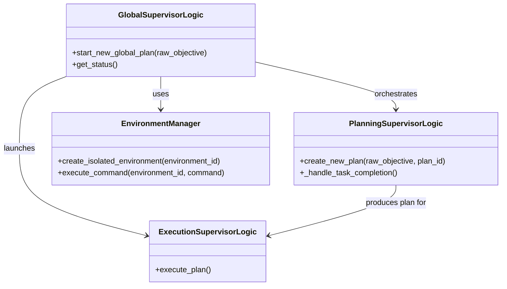

# Supervisor Class Diagrams

This document presents the main classes coordinating OrchestrAI. The Mermaid diagram shows how the supervisors interact with each other and with the `EnvironmentManager`.

