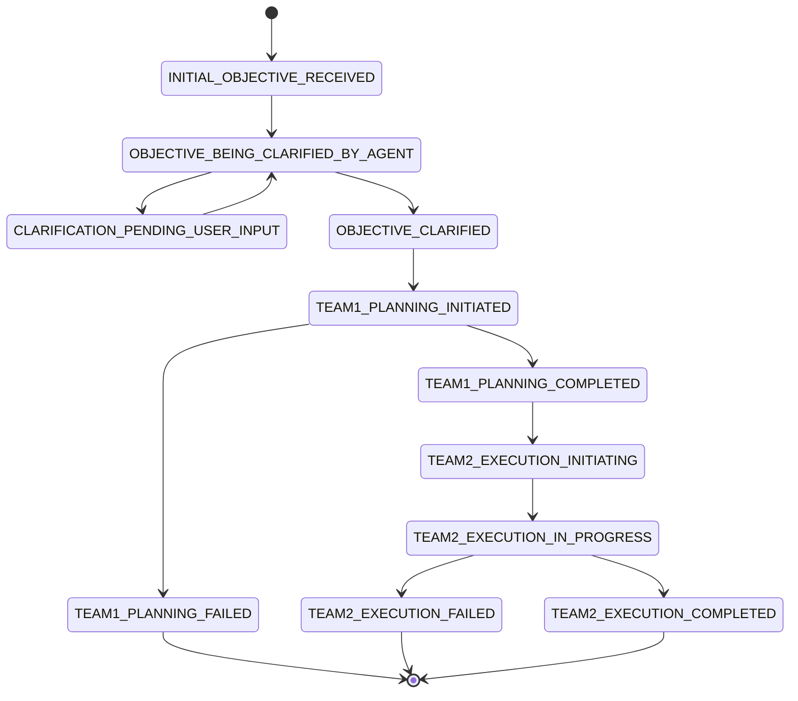
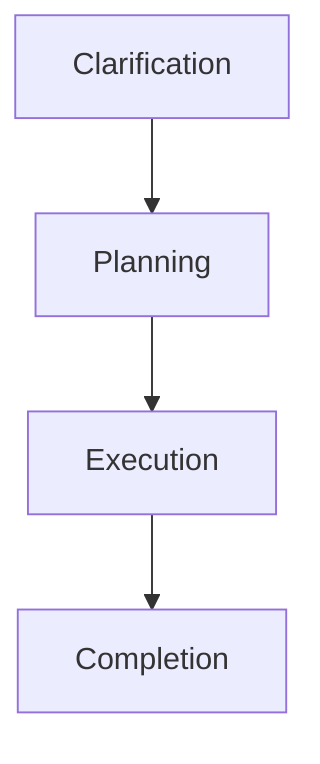

# Phase Diagrams

The supervisor logic drives several phases from clarification to execution. The state diagram below summarizes the lifecycle of a global plan.

## Global Plan State Machine

## High Level Phase Flow

